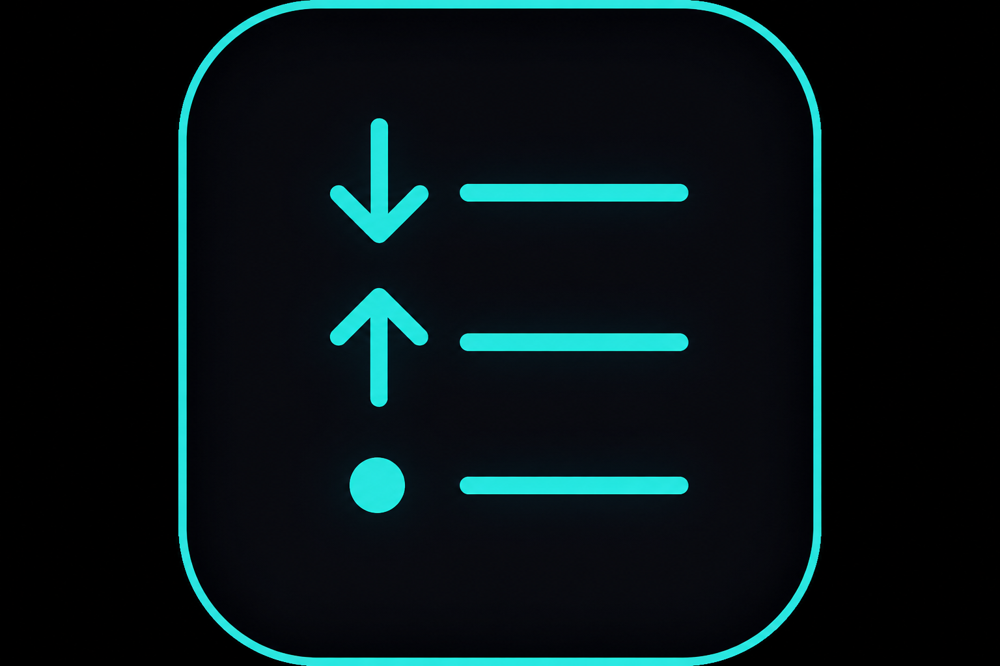

# PingIt

A lightweight Windows network overlay that shows live **download**, **upload**, and **ping** on top of your screen. It runs in the **system tray** (near the clock/Wi‑Fi/battery icons), uses **click-through** so it never blocks games or apps, and hides to tray like **Discord** when you close it.

**Repository:** [github.com/Muds1r/PingIt](https://github.com/Muds1r/PingIt)

<p align="center">
  
</p>

---

## Features

| Feature | Description |
|---------|-------------|
| Live download / upload | Real-time Mbps from your network adapters |
| Ping | ICMP latency in ms (default host: `1.1.1.1`) |
| Click-through overlay | Mouse passes through — safe for gaming |
| Hide to tray (Discord-style) | Close overlay → stays in tray, leaves taskbar |
| System tray control | All settings from the icon near the clock |
| First-run setup | Choose which stats to show on first launch |
| Move overlay | Drag to reposition only when unlocked from tray |
| Transparency & text size | 35%–100% opacity, Small / Medium / Large |
| Start with Windows | Optional auto-launch on login |
| Low overhead | Cached NICs, repaint on change, timers pause when hidden |
| Windows installer | Single `PingIt-Setup.exe` for end users |

---

## Project status (v1.2.0)

| Area | Status |
|------|--------|
| Live download / upload / ping | ✅ Done |
| Click-through + move overlay | ✅ Done |
| System tray + hide to tray | ✅ Done |
| First-run wizard | ✅ Done |
| Settings persistence | ✅ Done |
| Windows installer script | ✅ Done |
| Custom app icon | ✅ Tray, taskbar, installer |
| Ping host picker in UI | ❌ Edit JSON only |
| GitHub Actions CI / releases | ❌ Not set up |
| Unit tests | ❌ Not started |
| macOS / Linux | ❌ Windows only |

---

## For end users

### Install

1. Download `PingIt-Setup-1.2.0.exe` from [Releases](https://github.com/Muds1r/PingIt/releases) (or build it yourself — see below).
2. Run the installer and finish the wizard.
3. On **first launch**, pick which stats to show (Download, Upload, Ping).
4. Drag the overlay where you want it, then open the **PingIt tray icon** → turn off **Move overlay**.

PingIt keeps running in the background. When the overlay is hidden, it leaves the **taskbar** and only the **system tray** icon remains (same idea as Discord).

### Close vs quit (Discord-style)

| Action | Result |
|--------|--------|
| **×** on overlay (while **Move overlay** is on), **Alt+F4**, or taskbar close | Hides overlay, **removes taskbar icon**, app **keeps running** in tray |
| Tray → untick **Show overlay** | Same — hidden, still running |
| Tray → **Quit PingIt** | Fully exits the app |

The first time you close to tray, a balloon tip reminds you PingIt is still running in the background.

### Click-through + gaming

| Overlay state | Behavior |
|---------------|----------|
| **Locked** (default) | Stats visible, mouse clicks pass through to games/apps |
| **Move overlay** on | Draggable, **×** button visible, dashed blue border |
| **Hidden to tray** | No overlay, no taskbar — monitoring pauses until shown again |

### Daily use

| Action | How |
|--------|-----|
| Change what’s shown | Tray icon → **Show** → tick/untick stats |
| Move the overlay | Tray icon → enable **Move overlay**, drag, then disable |
| Transparency / text size | Tray icon → **Transparency** or **Text size** |
| Hide overlay | Tray icon → untick **Show overlay**, or close with **×** / Alt+F4 |
| Show overlay again | Double-click tray icon, or tick **Show overlay** |
| Start on boot | Tray icon → **Start with Windows** |
| Quit completely | Tray icon → **Quit PingIt** |

### Overlay display

Each stat is on **its own line**:

```
▼   12.5 Mbps    ← Download
▲    3.2 Mbps    ← Upload
●     24 ms      ← Ping
```

When **Move overlay** is on, a dashed blue border and **×** appear so you know the overlay is unlocked.

### Settings file

`%AppData%\PingIt\settings.json`

```json
{
  "X": 20,
  "Y": 20,
  "PingHost": "1.1.1.1",
  "TextSize": 1,
  "Opacity": 0.85,
  "ShowDownload": true,
  "ShowUpload": true,
  "ShowPing": true,
  "StartWithWindows": false,
  "SetupCompleted": true,
  "OverlayVisible": true,
  "TrayCloseHintShown": false
}
```

To change ping target, edit `"PingHost"` (e.g. `"8.8.8.8"`) and restart PingIt.

---

## Requirements

- **Windows 10 or 11**
- ICMP ping allowed (for the ping line)
- **.NET 8 SDK** only if building from source — end users do **not** need it when using the installer

> WinForms + `net8.0-windows` — **Windows only**. Cannot run natively on macOS/Linux.

---

## Build from source

### Run in development

```powershell
git clone https://github.com/Muds1r/PingIt.git
cd PingIt
dotnet run --project PingIt/PingIt.csproj
```

### Release build

```powershell
dotnet build PingIt.sln -c Release
```

Output: `PingIt\bin\Release\net8.0-windows\PingIt.exe`

### Build installer (setup.exe)

On Windows, with [.NET 8 SDK](https://dotnet.microsoft.com/download/dotnet/8.0) and [Inno Setup 6](https://jrsoftware.org/isdl.php):

```powershell
.\scripts\build-installer.ps1
# or with version:
.\scripts\build-installer.ps1 -Version 1.2.0
```

Output: `dist\installer\PingIt-Setup-1.2.0.exe`

---

## Project structure

```
PingIt/
├── PingIt.sln
├── README.md
├── LICENSE
├── installer/PingIt.iss
├── scripts/build-installer.ps1
└── PingIt/
    ├── Program.cs              # Entry, first-run wizard, single instance
    ├── OverlayForm.cs          # Overlay window, timers, tray integration
    ├── OverlayRenderer.cs      # Drawing (stats, close button, borders)
    ├── OverlayMenu.cs          # Settings menu (used by tray)
    ├── TrayHost.cs             # System tray icon + notifications
    ├── SetupWizardForm.cs      # First-run stat picker
    ├── MonitorSession.cs       # Coordinates network + ping monitors
    ├── NetworkMonitor.cs       # Mbps from adapter counters
    ├── PingMonitor.cs          # Async ICMP ping
    ├── AppSettings.cs          # Persistent JSON settings
    ├── AppConstants.cs         # Intervals, colors, presets
    ├── MetricFormatter.cs      # Speed/ping text formatting
    ├── TextSize.cs             # Small / Medium / Large enum
    ├── AppIcons.cs              # Loads app.ico for tray and window
    ├── StartupHelper.cs        # Windows Run registry (boot startup)
    └── Win32Window.cs          # Topmost + click-through Win32 APIs
```

---

## How it works

- **Speed** — Every second (when overlay visible), reads IPv4 byte counters from active adapters, computes Mbps delta. NIC list cached for 30 s.
- **Ping** — Every 3 seconds, ICMP ping to `PingHost` (2 s timeout). Stops when Ping is hidden or overlay is in tray.
- **Click-through** — `WS_EX_TRANSPARENT` when locked; removed when **Move overlay** or tray menu is open.
- **Tray** — Closing the overlay hides it; only **Quit PingIt** exits. Timers pause while hidden to save CPU.

---

## Troubleshooting

| Issue | Fix |
|-------|-----|
| Can't find PingIt | Click the **^** arrow in the taskbar to show hidden tray icons |
| Can't click the overlay | Normal — it's click-through. Use tray → **Move overlay** |
| Ping shows `— ms` | Firewall/VPN blocking ICMP; edit `PingHost` in settings JSON |
| Speed is `0.00 Mbps` | Normal when idle; first second is always 0 |
| Two copies running | Only one instance allowed; second launch is ignored |
| Overlay not on top in exclusive fullscreen | Use borderless/windowed fullscreen; exclusive mode blocks all overlays |

---

## Recommended next changes (for developers)

### Should fix / add soon

| Priority | Item | Why |
|----------|------|-----|
| High | **Custom `.ico`** for tray, taskbar, installer | Looks professional; currently uses `SystemIcons.Application` |
| High | **Ping host picker** in tray menu | Users shouldn't edit JSON for gaming |
| High | **GitHub Actions** release workflow | Auto-build `PingIt-Setup.exe` on tag |
| Medium | **Pause ping when all stats hidden** | Already pauses when overlay hidden; could also skip if only ping off |
| Medium | **Multi-monitor bounds check** | Keep overlay on screen after resolution change |
| Low | **Hotkey** (e.g. Ctrl+Shift+P) | Toggle overlay show/hide |

### Feature ideas

- Color-coded ping (green / yellow / red)
- Per-adapter selection (Wi‑Fi only vs all)
- Mini sparkline graph (last 60 s)
- “Run on close” tray setting (already default — could make optional)
- Auto-update check from GitHub Releases

### Code health (optional)

- Unit tests for `NetworkMonitor`, `MetricFormatter`, `AppSettings`
- Extract `OverlayForm` timer logic into a small `MonitoringController`
- Add `app.ico` to `PingIt.csproj` via `<ApplicationIcon>`

---

## License

MIT — see [LICENSE](LICENSE).

---

## Roadmap

- [x] Custom app icon
- [ ] Ping host picker in tray menu
- [ ] GitHub Actions — auto-build installer on release
- [ ] Per-adapter selection
- [ ] Color-coded ping
- [ ] Global hotkey to show/hide overlay
